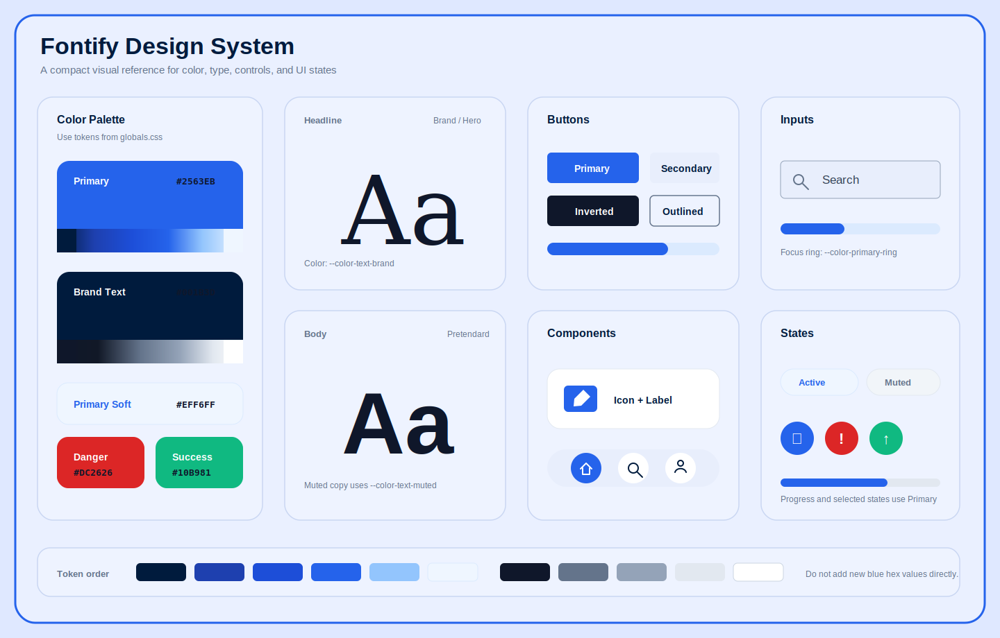

# Fontify Design System

## Color Tokens

Fontify의 기본 색상은 `src/styles/globals.css`의 CSS custom properties를 기준으로 사용한다.

### Brand

| Token | Value | Usage |
| --- | --- | --- |
| `--color-primary` | `#2563eb` | 주요 버튼, 활성 탭, 링크, 진행 상태 |
| `--color-primary-hover` | `#1d4ed8` | 주요 버튼 hover, 강조 상태 |
| `--color-primary-strong` | `#1e40af` | 브랜드 텍스트, 강한 강조 |
| `--color-primary-soft` | `#eff6ff` | 선택 배경, 칩, 은은한 강조 배경 |
| `--color-primary-muted` | `#dfe8ff` | 배지, 진행 상태 보조 배경 |
| `--color-primary-border` | `#dbeafe` | 파란 계열 보더 |
| `--color-primary-ring` | `rgba(37,99,235,.14)` | focus ring, active ring |

### Surface

| Token | Usage |
| --- | --- |
| `--color-bg` | 기본 흰 배경 |
| `--color-bg-subtle` | 살짝 구분되는 섹션 배경 |
| `--color-bg-page` | 페이지 단위의 옅은 배경 |
| `--color-bg-panel` | 패널/비활성 트랙 배경 |

### Text

| Token | Usage |
| --- | --- |
| `--color-text` | 본문/제목 기본 |
| `--color-text-strong` | 강한 제목 |
| `--color-text-brand` | Fontify 브랜드성 제목 |
| `--color-text-muted` | 보조 텍스트 |
| `--color-text-soft` | 플레이스홀더, 비활성 텍스트 |

### Borders

| Token | Usage |
| --- | --- |
| `--color-border` | 일반 보더 |
| `--color-border-soft` | 카드 내부, 약한 구분선 |
| `--color-border-strong` | 입력창, 컨트롤 경계 |

## Rules

- 새 파란색 hex를 직접 추가하지 말고 `--color-primary*` 토큰을 먼저 사용한다.
- 카드 배경은 `--color-bg`, 페이지 배경은 `--color-bg-page` 또는 `--color-bg-subtle`을 사용한다.
- 본문 회색은 `--color-text-muted`, 비활성 회색은 `--color-text-soft`를 사용한다.
- 도메인성 태그 색상은 유지할 수 있지만, 기본 액션/네비게이션/상태 색은 브랜드 토큰으로 통일한다.
